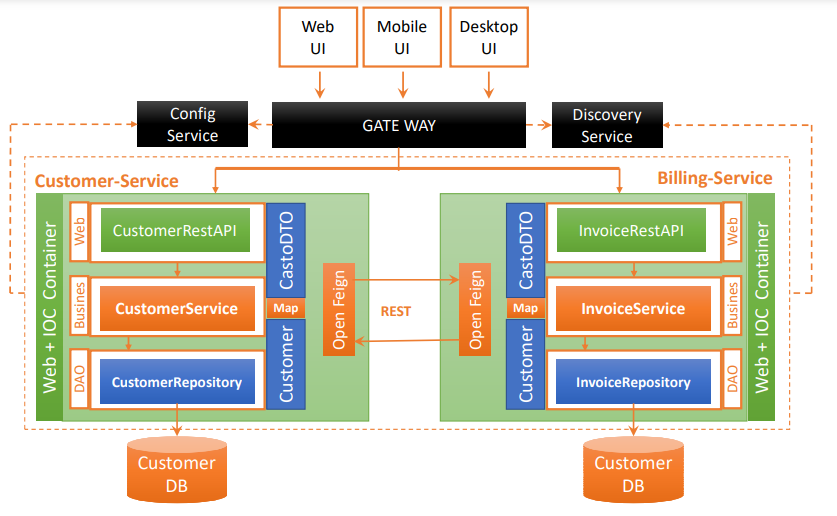
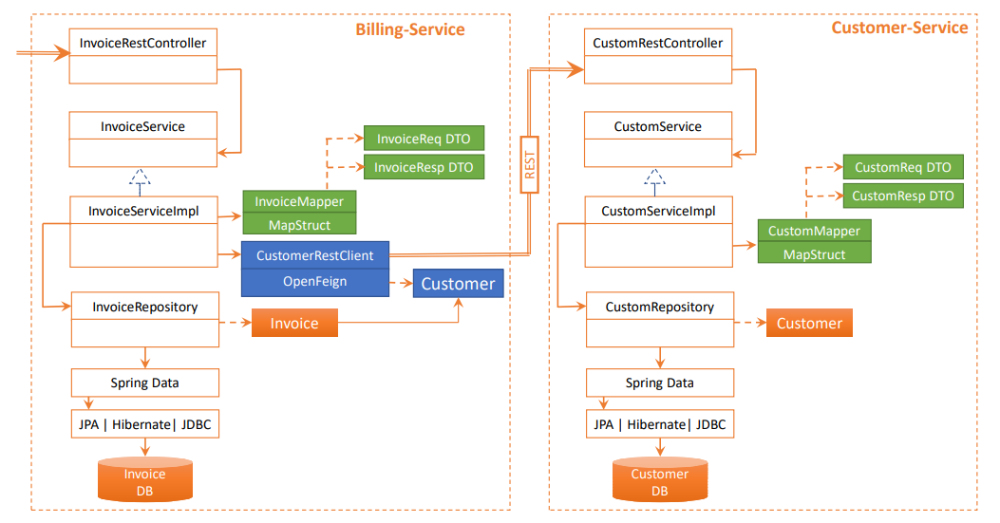
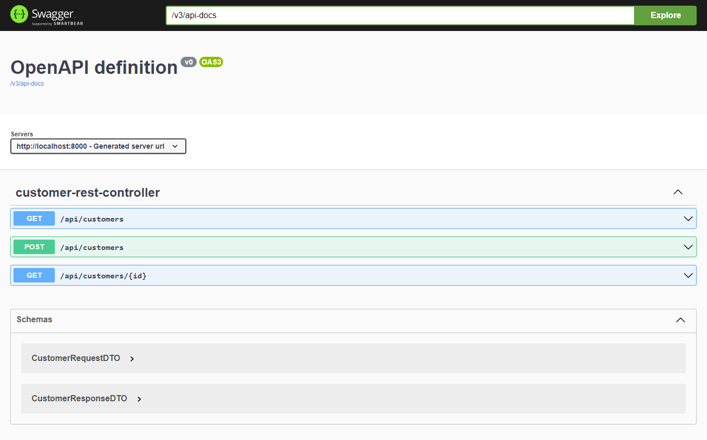
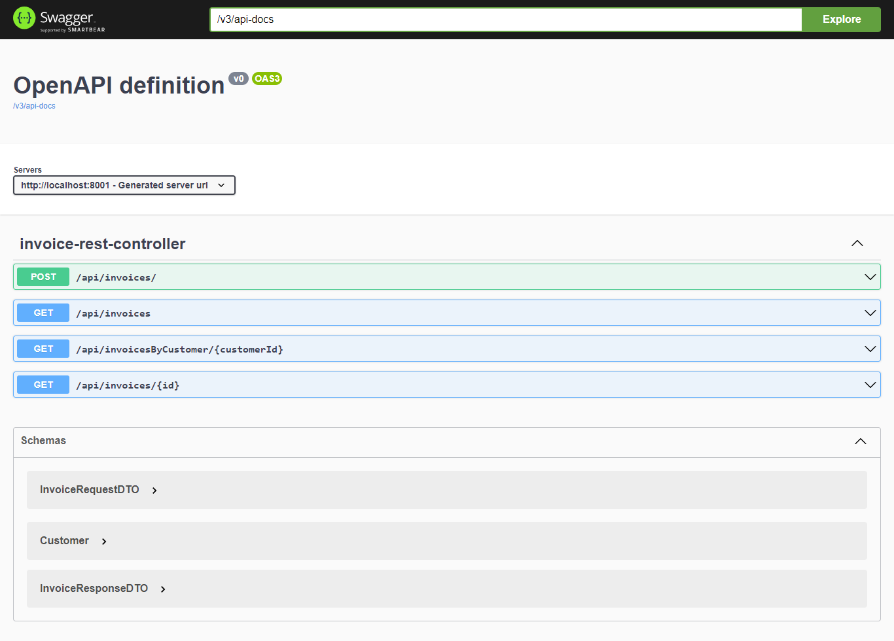

# Project Description
In this project we are going to implement two microservices which are the customer-service and billing-service and that via Spring Cloud Gateway and Eureka Discovery Client using Spring Frameworks (Spring boot, Spring Data, Spring Cloud ...) and other libraries. like MapStruct (for DTO data transfer Objects) and springdoc-openapi-ui to provide microservice documentation.

All this to obtain a very efficient architecture and also to guarantee good development practice.

# Project architecture





# Customer-Service
## Dependencies
* spring-boot-starter-data-jpa
* spring-boot-starter-web
* spring-cloud-starter-netflix-eureka-client
* spring-boot-starter-test
* h2database
* lombok
* mapstruct
* springdoc-openapi-ui
## Customer Entity Class
The customer class is a persistent class that represents a customer
```java
package com.basry.customerservice.entities;

import lombok.AllArgsConstructor;
import lombok.Data;
import lombok.NoArgsConstructor;

import javax.persistence.Entity;
import javax.persistence.Id;

@Entity
@Data @AllArgsConstructor @NoArgsConstructor
public class Customer {
    @Id
    private String id;
    private  String email;
    private String name;
}
``` 
## Customer Repository Interface
CustomerRepository is generic JPA Repository for persisting Customer objects into relational databases
```java
package com.basry.customerservice.repositories;

import com.basry.customerservice.entities.Customer;
import org.springframework.data.jpa.repository.JpaRepository;

public interface CustomerRepository extends JpaRepository<Customer, String> {
}
``` 
## Data Transfer Objects DTO
### CustomerRequestDTO
```java
package com.basry.customerservice.dto;

import lombok.AllArgsConstructor;
import lombok.Data;

@Data
@AllArgsConstructor
public class CustomerRequestDTO {
    private String id;
    private  String email;
    private String name;
}
``` 
### CustomerResponseDTO   
```java
package com.basry.customerservice.dto;

import lombok.Data;

@Data
public class CustomerResponseDTO {
    private String id;
    private  String email;
    private String name;
}
``` 
### CustomerMapper Interface
   ```java
package com.basry.customerservice.mappers;

import com.basry.customerservice.dto.CustomerRequestDTO;
import com.basry.customerservice.dto.CustomerResponseDTO;
import com.basry.customerservice.entities.Customer;
import org.mapstruct.Mapper;

@Mapper(componentModel = "spring")
public interface CustomerMapper {
    CustomerResponseDTO customerToCustomerResponseDTO(Customer customer);
    Customer customerRequestDTOToCustomer(CustomerRequestDTO customerRequestDTO);
}
```     
## Services
### CustomerService Interface
   ```java
package com.basry.customerservice.services;

import com.basry.customerservice.dto.CustomerRequestDTO;
import com.basry.customerservice.dto.CustomerResponseDTO;

import java.util.List;

public interface CustomerService  {
    CustomerResponseDTO save(CustomerRequestDTO customerRequestDTO);
    CustomerResponseDTO getCustomer(String id);
    CustomerResponseDTO update(CustomerRequestDTO customerRequestDTO);
    List<CustomerResponseDTO> listCustomers();
}
```     
### CustomerServiceImplementation Class
   ```java
package com.basry.customerservice.services;

import com.basry.customerservice.dto.CustomerRequestDTO;
import com.basry.customerservice.dto.CustomerResponseDTO;
import com.basry.customerservice.entities.Customer;
import com.basry.customerservice.mappers.CustomerMapper;
import com.basry.customerservice.repositories.CustomerRepository;
import org.springframework.stereotype.Service;

import javax.transaction.Transactional;
import java.util.List;
import java.util.UUID;
import java.util.stream.Collectors;

@Service
@Transactional
public class CustomerServiceImpl implements  CustomerService{
    private CustomerRepository customerRepository;
    private CustomerMapper customerMapper;
    private  CustomerResponseDTO customerResponseDTO;

    public CustomerServiceImpl(CustomerRepository customerRepository, CustomerMapper customerMapper) {
        this.customerRepository = customerRepository;
        this.customerMapper = customerMapper;
    }

    @Override
    public CustomerResponseDTO save(CustomerRequestDTO customerRequestDTO) {
        customerRequestDTO.setId(UUID.randomUUID().toString());
        Customer customer = customerMapper.customerRequestDTOToCustomer(customerRequestDTO);
        Customer savedCustomer = customerRepository.save(customer);
        this.customerResponseDTO = customerMapper.customerToCustomerResponseDTO(savedCustomer);
        return customerResponseDTO;
    }

    @Override
    public CustomerResponseDTO getCustomer(String id) {
        Customer customer = customerRepository.findById(id).get();
        this.customerResponseDTO = customerMapper.customerToCustomerResponseDTO(customer);
        return customerResponseDTO;
    }

    @Override
    public CustomerResponseDTO update(CustomerRequestDTO customerRequestDTO) {
        Customer customer = customerMapper.customerRequestDTOToCustomer(customerRequestDTO);
        Customer updatedCustomer = customerRepository.save(customer);
        this.customerResponseDTO = customerMapper.customerToCustomerResponseDTO(updatedCustomer);
        return customerResponseDTO;
    }

    @Override
    public List<CustomerResponseDTO> listCustomers() {
        List<Customer> customers = customerRepository.findAll();
        List<CustomerResponseDTO> customerResponseDTOS = customers.stream().map(customer ->
                customerMapper.customerToCustomerResponseDTO(customer)).collect(Collectors.toList());
        return customerResponseDTOS;
    }
}
```  
## Web
## CustomerRestController Class
   ```java
package com.basry.customerservice.web;

import com.basry.customerservice.dto.CustomerRequestDTO;
import com.basry.customerservice.dto.CustomerResponseDTO;
import com.basry.customerservice.entities.Customer;
import com.basry.customerservice.services.CustomerService;
import org.springframework.web.bind.annotation.*;

import java.util.List;

@RestController
@RequestMapping(path = "/api")
public class CustomerRestController {
    private CustomerService customerService;

    public CustomerRestController(CustomerService customerService) {
        this.customerService = customerService;
    }
    @GetMapping(path = "/customers")
    public List<CustomerResponseDTO> allCustomers(){
        return customerService.listCustomers();
    }
    @GetMapping(path = "/customers/{id}")
    public CustomerResponseDTO getCustomer(@PathVariable(name = "id") String id){
        return customerService.getCustomer(id);
    }
    @PostMapping(path = "/customers")
    public CustomerResponseDTO save(@RequestBody CustomerRequestDTO customerRequestDTO){
        return customerService.save(customerRequestDTO);
    }
}
```  


# Billing-Service
## Dependencies
* spring-boot-starter-data-jpa
* spring-boot-starter-web
* spring-cloud-starter-netflix-eureka-client
* spring-cloud-starter-openfeign
* spring-boot-starter-test
* h2database
* lombok
* mapstruct
* springdoc-openapi-ui
## Invoice Entity Class
The Invoice class is a persistent class that represents a Invoice
```java
package com.basry.billingservice.entities;

import com.basry.billingservice.models.Customer;
import lombok.AllArgsConstructor;
import lombok.Data;
import lombok.NoArgsConstructor;

import javax.persistence.Entity;
import javax.persistence.Id;
import javax.persistence.Transient;
import java.math.BigDecimal;
import java.util.Date;

@Entity
@Data @AllArgsConstructor @NoArgsConstructor
public class Invoice {
    @Id
    private String id;
    private Date date;
    private BigDecimal amount;
    private String customerID;
    @Transient
    private Customer customer;
}
``` 

## Customer model class
```java
package com.basry.billingservice.models;

import lombok.Data;

@Data
public class Customer {
    private String id;
    private  String email;
    private String name;
}
``` 

## Invoice Repository Interface
InvoiceRepository is generic JPA Repository for persisting Invoice objects into relational databases
```java
package com.basry.billingservice.repositories;

import com.basry.billingservice.entities.Invoice;
import org.springframework.data.jpa.repository.JpaRepository;

import java.util.List;

public interface InvoiceRepository extends JpaRepository<Invoice, String> {
    List<Invoice> findByCustomerID(String customerID);
}
``` 
## Data Transfer Objects DTO
### InvoiceRequestDTO
```java
package com.basry.billingservice.dto;

import com.basry.billingservice.models.Customer;
import lombok.AllArgsConstructor;
import lombok.Data;
import lombok.NoArgsConstructor;

import javax.persistence.Entity;
import javax.persistence.Id;
import javax.persistence.Transient;
import java.math.BigDecimal;
import java.util.Date;


@Data @AllArgsConstructor @NoArgsConstructor
public class InvoiceRequestDTO {
    private BigDecimal amount;
    private String customerID;
}
``` 
### InvoiceResponseDTO
```java
package com.basry.billingservice.dto;

import com.basry.billingservice.models.Customer;
import lombok.AllArgsConstructor;
import lombok.Data;
import lombok.NoArgsConstructor;

import javax.persistence.Entity;
import javax.persistence.Id;
import javax.persistence.Transient;
import java.math.BigDecimal;
import java.util.Date;


@Data @AllArgsConstructor @NoArgsConstructor
public class InvoiceResponseDTO {
    private String id;
    private Date date;
    private BigDecimal amount;
    private Customer customer;
}
``` 
### InvoiceMapper Interface
   ```java
package com.basry.billingservice.mappers;

import com.basry.billingservice.dto.InvoiceRequestDTO;
import com.basry.billingservice.dto.InvoiceResponseDTO;
import com.basry.billingservice.entities.Invoice;
import org.mapstruct.Mapper;

@Mapper(componentModel = "spring")
public interface InvoiceMapper {
    Invoice fromInvoiceRequestDTO(InvoiceRequestDTO invoiceRequestDTO);
    InvoiceResponseDTO fromInvoice(Invoice invoice);
}
```     
## Services
### InvoiceService Interface
   ```java
package com.basry.billingservice.services;

import com.basry.billingservice.dto.InvoiceRequestDTO;
import com.basry.billingservice.dto.InvoiceResponseDTO;

import java.util.List;

public interface InvoiceService {
    InvoiceResponseDTO save(InvoiceRequestDTO invoiceRequestDTO);
    InvoiceResponseDTO getInvoice(String id);
    List<InvoiceResponseDTO> invoicesByCustomer(String customerID);
    List<InvoiceResponseDTO> allInvoices();
}
```     
### InvoiceServiceImpl Class
   ```java
package com.basry.billingservice.services;

import com.basry.billingservice.dto.InvoiceRequestDTO;
import com.basry.billingservice.dto.InvoiceResponseDTO;
import com.basry.billingservice.entities.Invoice;
import com.basry.billingservice.exceptions.CustomerNotFoundException;
import com.basry.billingservice.mappers.InvoiceMapper;
import com.basry.billingservice.models.Customer;
import com.basry.billingservice.openfeign.CustomerRestClient;
import com.basry.billingservice.repositories.InvoiceRepository;
import net.bytebuddy.implementation.bytecode.Throw;
import org.springframework.stereotype.Service;
import org.springframework.transaction.annotation.Transactional;

import java.util.Date;
import java.util.List;
import java.util.UUID;
import java.util.stream.Collectors;

@Service
@Transactional
public class InvoiceServiceImpl implements InvoiceService {
    private final InvoiceRepository invoiceRepository;
    private final InvoiceMapper invoiceMapper;
    private final CustomerRestClient customerRestClient;

    public InvoiceServiceImpl(InvoiceRepository invoiceRepository, InvoiceMapper invoiceMapper, CustomerRestClient customerRestClient) {
        this.invoiceRepository = invoiceRepository;
        this.invoiceMapper = invoiceMapper;
        this.customerRestClient = customerRestClient;
    }

    @Override
    public InvoiceResponseDTO save(InvoiceRequestDTO invoiceRequestDTO) {
        Customer customer;
        try{
            customer = customerRestClient.customerById(invoiceRequestDTO.getCustomerID());
        }catch (Exception e){
            throw new CustomerNotFoundException("Customer not found");
        }
        Invoice invoice = invoiceMapper.fromInvoiceRequestDTO(invoiceRequestDTO);
        invoice.setId(UUID.randomUUID().toString());
        invoice.setDate(new Date());
        Invoice savedInvoice = invoiceRepository.save(invoice);
        savedInvoice.setCustomer(customer);
        InvoiceResponseDTO invoiceResponseDTO = invoiceMapper.fromInvoice(savedInvoice);
        return invoiceResponseDTO;
    }

    @Override
    public InvoiceResponseDTO getInvoice(String id) {
        Customer customer;
        Invoice invoice = invoiceRepository.findById(id).get();
        try{
            customer = customerRestClient.customerById(invoice.getCustomerID());
        }catch (Exception e){
            throw new CustomerNotFoundException("Customer not found");
        }
        invoice.setCustomer(customer);
        InvoiceResponseDTO invoiceResponseDTO = invoiceMapper.fromInvoice(invoice);
        return invoiceResponseDTO;
    }

    @Override
    public List<InvoiceResponseDTO> invoicesByCustomer(String customerID) {
        List<Invoice> invoices = invoiceRepository.findByCustomerID(customerID);
        return invoices.stream().map(invoice ->{
            Customer customer = customerRestClient.customerById(invoice.getCustomerID());
            invoice.setCustomer(customer);
            return invoiceMapper.fromInvoice(invoice);
        }).collect(Collectors.toList());
    }
    @Override
    public List<InvoiceResponseDTO> allInvoices() {
        List<Invoice> invoices = invoiceRepository.findAll();
        return invoices.stream().map(invoice ->{
            Customer customer = customerRestClient.customerById(invoice.getCustomerID());
            if(customer != null){
                invoice.setCustomer(customer);
                return invoiceMapper.fromInvoice(invoice);
            }
            return  null;
        }).collect(Collectors.toList());
    }
}
```  
## Web
## InvoiceRestController Class
   ```java
package com.basry.billingservice.web;

import com.basry.billingservice.dto.InvoiceRequestDTO;
import com.basry.billingservice.dto.InvoiceResponseDTO;
import com.basry.billingservice.exceptions.CustomerNotFoundException;
import com.basry.billingservice.services.InvoiceService;
import org.springframework.http.HttpStatus;
import org.springframework.http.ResponseEntity;
import org.springframework.web.bind.annotation.*;

import java.util.List;

@RestController
@RequestMapping(path = "api")
public class InvoiceRestController {
    private InvoiceService invoiceService;

    public InvoiceRestController(InvoiceService invoiceService) {
        this.invoiceService = invoiceService;
    }

    @GetMapping(path = "/invoices/{id}")
    public InvoiceResponseDTO getInvoice(@PathVariable(name = "id") String id){
        return invoiceService.getInvoice(id);
    }

    @PostMapping(path = "/invoices/")
    public InvoiceResponseDTO save(@RequestBody InvoiceRequestDTO invoiceRequestDTO){
        return invoiceService.save(invoiceRequestDTO);
    }

    @GetMapping(path = "/invoicesByCustomer/{customerId}")
    public List<InvoiceResponseDTO> getInvoicesByCustomer(@PathVariable(name = "customerId")String customerId){
        return invoiceService.invoicesByCustomer(customerId);
    }

    @GetMapping(path = "/invoices")
    public List<InvoiceResponseDTO> getAllInvoices(){
        return invoiceService.allInvoices();
    }

    @ExceptionHandler(Exception.class)
    public ResponseEntity<String > exceptionHandler(Exception e){
        return new ResponseEntity<>(e.getMessage(), HttpStatus.INTERNAL_SERVER_ERROR);
    }
}
```  
## OpenFeign Interface
   ```java
package com.basry.billingservice.openfeign;

import com.basry.billingservice.models.Customer;
import org.springframework.cloud.openfeign.FeignClient;
import org.springframework.web.bind.annotation.GetMapping;
import org.springframework.web.bind.annotation.PathVariable;

import java.util.List;

@FeignClient(name = "CUSTOMER-SERVICE")
public interface CustomerRestClient {
    @GetMapping(path = "/api/customers/{id}")
    Customer customerById(@PathVariable(name = "id") String id);
    @GetMapping(path = "/api/customers")
    List<Customer> getCustomers();
}
```  
## Exceptions 
### CustomerNotFoundException
```java
package com.basry.billingservice.exceptions;

public class CustomerNotFoundException extends RuntimeException {
    public CustomerNotFoundException(String customer_not_found) {
        super(customer_not_found);
    }
}
```
# Gateway-service
## Dependencies
* spring-cloud-starter-gateway
* spring-cloud-starter-netflix-eureka-client
* spring-boot-starter-test
## GatewayServiceApplication
```java
package com.basry.gatewayservice;

import org.springframework.boot.SpringApplication;
import org.springframework.boot.autoconfigure.SpringBootApplication;
import org.springframework.cloud.client.discovery.ReactiveDiscoveryClient;
import org.springframework.cloud.gateway.discovery.DiscoveryClientRouteDefinitionLocator;
import org.springframework.cloud.gateway.discovery.DiscoveryLocatorProperties;
import org.springframework.context.annotation.Bean;

@SpringBootApplication
public class GatewayServiceApplication {

    public static void main(String[] args) {
        SpringApplication.run(GatewayServiceApplication.class, args);
    }

    @Bean
    DiscoveryClientRouteDefinitionLocator dynamicRoutes(ReactiveDiscoveryClient discoveryClient, DiscoveryLocatorProperties locatorProperties){
        return new DiscoveryClientRouteDefinitionLocator(discoveryClient,locatorProperties);
    }
}
```
# Eureka-service
## Dependencies
* spring-cloud-starter-netflix-eureka-server
* spring-boot-starter-test

## StoreEurekaServiceApplication
```java
package com.basry.storeeurekaservice;

import org.springframework.boot.SpringApplication;
import org.springframework.boot.autoconfigure.SpringBootApplication;
import org.springframework.cloud.netflix.eureka.server.EnableEurekaServer;

@SpringBootApplication
@EnableEurekaServer
public class StoreEurekaServiceApplication {

    public static void main(String[] args) {
        SpringApplication.run(StoreEurekaServiceApplication.class, args);
    }

}
```
# Documentation
## Customer Documentation

## Invoice Documentation
